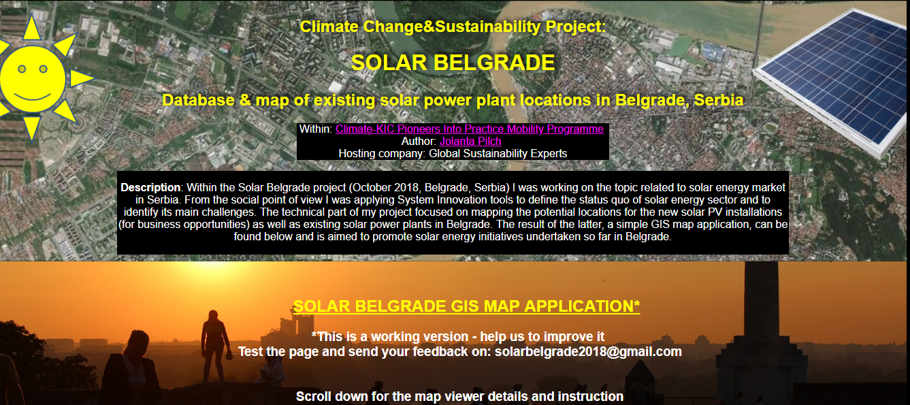

# my website about Solar Belgrade project - database and GIS map

This website is a result of the project Solar Belgrade done within Pioneers into Practice Climate-KIC programme. 
It is a simple static website and contains link to the database and GIS map application on existing solar power plants in Belgrade in Belgrade, Serbia.

 

The website is available on:
<h2> https://solar-belgrade.herokuapp.com/ </h2> 

## Descritpion and application 

This is a working version of the website, database and GIS map application. Because the project realisation time was very tight I developed 
a temporary framework which I wish to upgrade in the future. 
The current solutions is based mostly on the open-source software and platforms, however, they are not enough integrated to avoid manual 
data transfer and manipulation. 

<br/>The website html is available in :open_file_folder: Heroku_website/index.html 
<br/>The project PostgreSQL database is available in :open_file_folder: PostgresPostGIS_db/DB_backups/
<br/>The project QGIS project and data is available in :open_file_folder: QGIS_project/Project/SolarBelgrade_Existing_Solar_Panels_git.qgs

 

## Example of code
As this is my really first website it is written with a very basic and simple html and css. 
It will be also improved and optimized with further project upgrade. 

``` 
<footer>
  
	<div class="webmaster">
		<p>"This project was realized during the Pioneers into Practice programme. 
		Pioneers into Practice is a programme of EIT Climate-KIC. 
		</br>EIT Climate-KIC is supported by the EIT, a body of the European Union."</p>
		<p>Project contact details: 
		</br>solarbelgrade2018@gmail.com</p>
		<p>Webmaster: JPilch
		</br> jolanta.pilch85@gmail.com</p>
	</div>
</footer>

``` 

## Further Documentation 

:closed_book: Detailed documentation exists on the project workflow, however, it can be accessed only on request. Heroku website contains some simple guidelines how to use the online GIS map application.


## How can I support developers? 

:+1: Support me with stars, good advice and keep your fingers crossed for my future in IT :smiley: 

## License 

[MIT](LICENSE.txt) license
<br/> [GNU](LICENSE.txt) license

## Special thanks 

Special thanks to Climate-KIC organization which enabled me to develop this project :smiley:
"This project was realized during the Pioneers into Practice programme. Pioneers into Practice is a programme of EIT Climate-KIC. 
EIT Climate-KIC is supported by the EIT, a body of the European Union."
